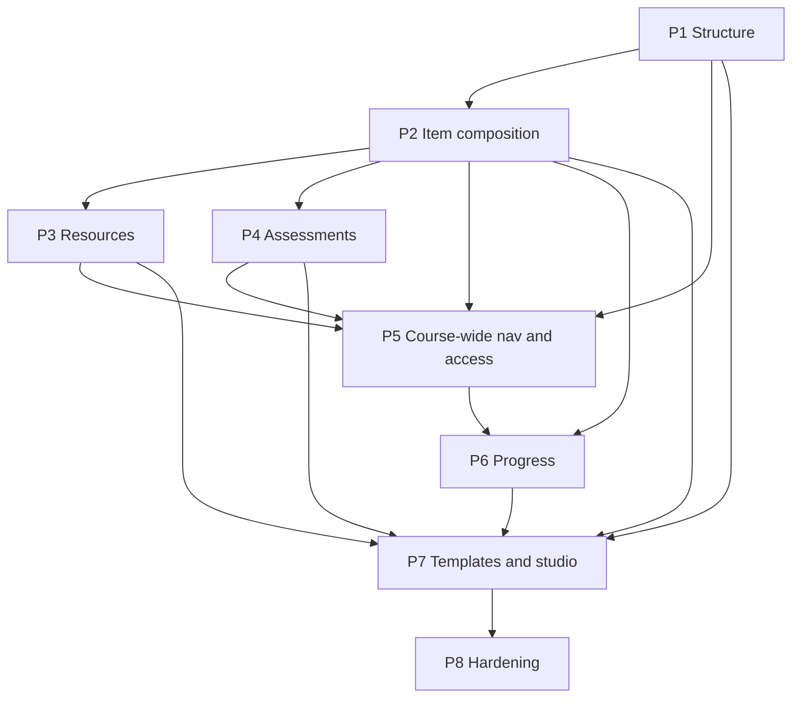

# GK Circle Feature Dependency Graph

Strict feature dependencies of the Universal Chained Course System after DOC-CS-T02-R1.
Canonical ownership and task-level edges: `modules/course-system/ROADMAP.md`.

## Dependency Graph

## Architectural Ordering Rules

1. Design-gate tasks precede related migrations.
2. A phase cannot be marked `VERIFIED` until checklist tasks are verified with evidence.
3. Later phases must not introduce product `MAX_*_DEPTH` or authoritative `child_node_ids[]`.
4. D-003 allows Phase 2 LearningItem work while Phase 1 UI remains open.
5. Phase 5 consumes Phase 1 breadcrumb/ancestor APIs; it does not redefine them.
