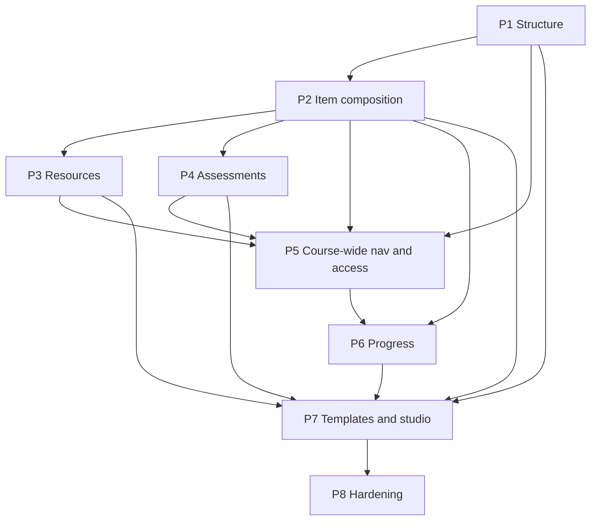

# Course System Implementation Roadmap

Single implementation-order index after **DOC-CS-T02-R1**.
Task checklists live only in `phases/`. Do not duplicate task tables here.

## Architecture freeze

```text
Course
└── CourseNode
    ├── parent_id → CourseNode | NULL   # AUTHORITATIVE
    ├── children  → derived projection
    └── LearningItem*                   # ordered content on any node
```

Canonical detail: `architecture/current.md`, **D-004**, **D-005**, ADR-023.
Subject / Module / Chapter / Lecture / Topic labels are **non-normative examples**.

## Documentation governance sequence

| ID | Role | Status |
|---|---|---|
| DOC-CS-T01 | Canonical architecture and relationship contract | Done |
| DOC-CS-T02 | Initial eight-phase expansion draft | Superseded for freeze by R1 |
| DOC-CS-T02-R1 | Ownership reconciliation, dependency rebuild, arithmetic repair, freeze-ready validation | This freeze |
| DOC-CS-T03 | Documentation normalization, cross-reference integrity, freeze markers | Done |
| DOC-CS-T04 | Final documentation audit and freeze certification | Done |

## Phase map

| Phase | File | Blueprint | Weight |
|---|---|---|---:|
| 1 | `phases/phase-01-course-tree.md` | Unlimited Recursive Course Tree Foundation | 15% |
| 2 | `phases/phase-02-learning-items.md` | Learning Items and Information Blocks | 15% |
| 3 | `phases/phase-03-resources-content.md` | Resources and Native Content | 15% |
| 4 | `phases/phase-04-assessments.md` | Assessments (any-depth bindings) | 15% |
| 5 | `phases/phase-05-chaining-unlocking.md` | Navigation, Unlocking, and Learning Sequence | 10% |
| 6 | `phases/phase-06-progress-completion.md` | Recursive Progress and Completion | 15% |
| 7 | `phases/phase-07-templates-builder.md` | Templates and Builder | 10% |
| 8 | `phases/phase-08-hardening.md` | Production Hardening | 5% |

## Ownership freeze

| Phase | Owns | Does not own |
|---|---|---|
| 1 | Structure, path, structural mutations/reads, learner outline, minimum structural editor | Items, resources, assessments, course-wide sequence, progress, studio |
| 2 | LearningItem composition, publish_state, node-local chain, item enrollment/visibility, item UIs | Course-wide sequence/Continue Learning, unlock DAG |
| 3 | Resource design gate → delivery/viewers | Quiz scoring, progress, templates |
| 4 | Quiz-engine binding at any depth | Second scorer; hierarchy-as-test-type |
| 5 | Course-wide sequence, unlock graphs, Continue Learning (consumes P1 breadcrumbs) | Structural editor; item metadata |
| 6 | Recursive progress and denominators | “Leaf node” product model |
| 7 | Templates + integrated studio reusing P1/P2; Cross-Course copy | Parallel live hierarchy |
| 8 | Auth model, audit, cache, stress, security, ops | Greenfield features |

## Three graphs (never collapse)

| Graph | Owner | Edge |
|---|---|---|
| Structural tree | Phase 1 | `parent_id` |
| Learning sequence | Phase 2 (node-local) + Phase 5 (course-wide) | ordered content / continue-learning |
| Prerequisite unlock DAG | Phase 5 | dependency edges |

## Cross-phase dependency graph



Parallel exception: **D-003** allows Phase 2 LearningItem work while Phase 1 UI remains open.

## Design gates (before related migrations)

* P3-T01 resource persistence decision
* P4-T01 quiz/course binding integration assessment
* P5-T01 sequence representation; P5-T02 prerequisite persistence
* P6-T01 progress event/aggregate design
* P7-T01 template persistence decision
* P8-T01 Course admin authorization model decision

## Current next coding task

See `CURRENT_STATUS.md` / `HANDOFF.md`. After DOC-CS-T02-R1:

* Preferred: `COURSE-P2-T20` (Deep-node LearningItem ownership tests) — depends on verified `COURSE-P2-T02` / `COURSE-P2-T08`.
* Also available under D-003: `COURSE-P1-T11` (Admin course list UI).
* Do not start `COURSE-P2-T09` until separately approved (composition UI; no longer blocked on P1 tree editor).
* `COURSE-P2-T10` (Reorder) and `COURSE-P2-T11` (Move) are VERIFIED.

## Forbidden roadmap assumptions

* Product `MAX_*_DEPTH` / fixed Subject→Chapter schema
* Authoritative `child_node_ids[]`
* Treating LearningItems as hierarchy edges
* Renaming CourseNode `status` to `publish_state`
* Claiming DOC-CS-T04 complete after T03 alone
* Starting implementation as part of DOC-CS-T03
