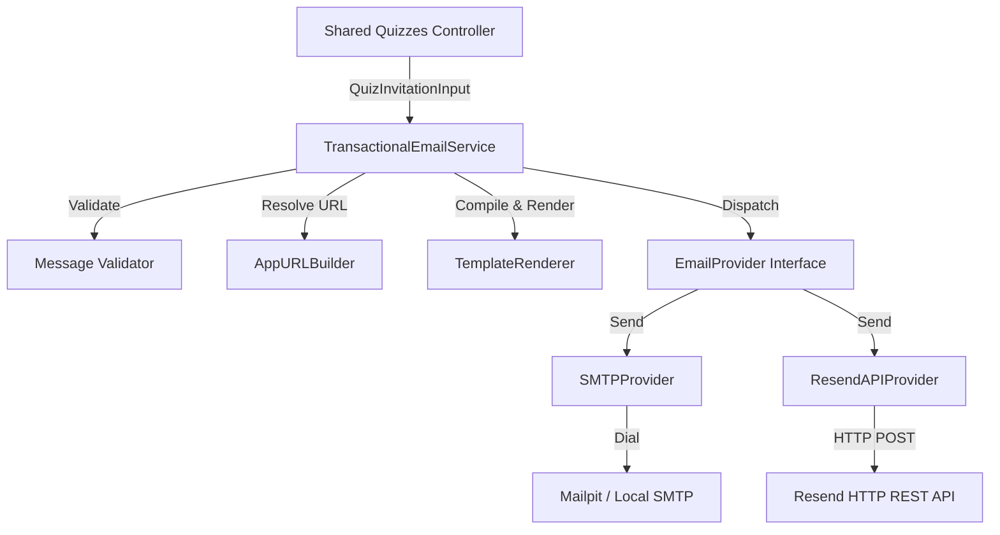

# GK Circle Transactional Email Operations Manual & Phase 2 Checklist

This document details the configuration parameters, sanitised logging rules, and operational procedures for GK Circle's Transactional Email Infrastructure implemented in Phase 2.

---

## Architecture Flow Diagram



---

## Dependency Specification

| Component / Library | Version / Constraint | Description / Role |
|---|---|---|
| Go | `1.24+` | Runtime execution platform |
| Fiber | `v2 (v2.52.x)` | HTTP router and web framework context handler |
| Resend API | `v1 (REST Emails)` | Production delivery endpoint |
| gomail | `gopkg.in/gomail.v2` | SMTP library wrapper for development relaying |
| envconfig | `github.com/kelseyhightower/envconfig` | Type-safe environment variable mapping parser |

---

## Performance baselines

* **Startup template compilation**: `< 5ms` (Single execution for all 21 embedded templates on boot)
* **Typical send latency**:
  * Resend API: `150ms - 300ms` (Outbound HTTP post, including TLS handshakes)
  * Local SMTP Relay: `10ms - 50ms` (Non-blocking TCP dial to Mailpit)
* **Timeout default**: `10s` (Max HTTP context deadline timeout)
* **Retry limit**: `3` attempts max (Exponential backoff with full-jitter up to 2 seconds cap)
* **Maximum recipients**: `50` (Enforced by validator to prevent bulk sending failures)

---

## 1. Core Configuration Reference

The application loads transactional email settings using environment variables mapped into the Go service at startup.

| Env Variable | Type / Format | Default | Description |
|---|---|---|---|
| `EMAIL_PROVIDER` | `resend` \| `smtp` | `smtp` | Primary active mail delivery provider. |
| `EMAIL_FROM` | string (Email) | `notifications@gkcircle.com` | Verified sending domain sender email address. |
| `EMAIL_FROM_NAME` | string | `GK Circle` | Display name prepended to outgoing messages. |
| `EMAIL_REPLY_TO` | string (Email) | None | Default reply-to header if applicable. |
| `EMAIL_HTTP_TIMEOUT` | Duration | `10s` | Outbound timeout cap for HTTP API calls. |
| `EMAIL_MAX_ATTEMPTS` | integer | `3` | Total delivery attempts (initial + retries). |
| `EMAIL_RETRY_BASE_DELAY` | Duration | `250ms` | Baseline interval before exponential backoff. |
| `EMAIL_RETRY_MAX_DELAY` | Duration | `2s` | Upper bound sleep interval cap. |
| `RESEND_API_KEY` | string (Bearer Token) | None | Production credential API token for Resend HTTP. |
| `SMTP_HOST` | string (IP/Host) | None | Development/Mailpit SMTP server hostname. |
| `SMTP_PORT` | integer | None | Development/Mailpit SMTP server port. |
| `SMTP_USER` | string | None | Credentials for SMTP auth. |
| `SMTP_PASSWORD` | string | None | Credentials for SMTP auth. |
| `SMTP_FROM` | string (Email) | None | Overrides `EMAIL_FROM` specifically for SMTP. |
| `SMTP_DISABLE_STARTTLS` | boolean | `false` | Explicitly disables STARTTLS if set to `true`. |
| `SMTP_INSECURE_SKIP_VERIFY` | boolean | `false` | Skips TLS verification (useful for local development). |

---

## 2. Sanitised Logging Architecture

To ensure strict compliance with SAIF, GPDR, and data security guidelines, no personally identifiable information (PII) or secrets are logged.

* **Sha256 Hashing**: Idempotency keys are hashed using SHA-256 and truncated to 16 hex characters before writing to standard out.
* **Domain Redaction**: Recipient email addresses are stripped, logging only the destination domain suffix (e.g. `gmail.com`).
* **Content Filtering**: Request and response bodies, password recovery tokens, OTPs, and API credentials are NEVER written to logs.
* **Error Sanitisation**: Provider connection errors are wrapped internally but logged publicly using generic descriptors to avoid exposing internal network hostnames or authorization header payloads.

### Example Logs

**Success Case**:
```json
{"level":"info","ts":"2026-07-29T10:25:32Z","msg":"Email accepted by provider","message_id":"d1e028b0-8c23-42e8-b716-e5c9bf55d95d","idempotency_key_hash":"d992f80c651f67de","email_type":"invitation","provider":"resend","provider_message_id":"re_abcdefg12345","recipient_domain":"gmail.com","template_name":"invitation","template_version":"v1","status":"accepted","latency_ms":182}
```

**Failure Case**:
```json
{"level":"error","ts":"2026-07-29T10:26:15Z","msg":"Email dispatch failed","message_id":"e33c66fa-1875-430c-83b4-ee1cb88f7292","idempotency_key_hash":"c1a8e8b22a014902","email_type":"invitation","provider":"resend","recipient_domain":"yahoo.com","template_name":"invitation","template_version":"v1","status":"failed","latency_ms":540,"error_kind":"rate_limited","http_status":429,"error":"received non-2xx status code 429"}
```

---

## 3. Webhook Integration Guide

To support future delivery event webhook callbacks, every email sent through Resend includes the `ProviderMessageID` returned in the HTTP response.
Store this mapping database column alongside the GK Circle internal correlation `MessageID`.

1. Webhook endpoint receives JSON event payloads from Resend or SMTP relay events.
2. The payload contains `id` (matching `ProviderMessageID`).
3. Query the internal logs or tables for the matching `ProviderMessageID` to update delivery status:
   * `delivered`: Successful mailbox delivery.
   * `bounced`: Invalid recipient mailbox.
   * `complained`: User marked message as spam.
